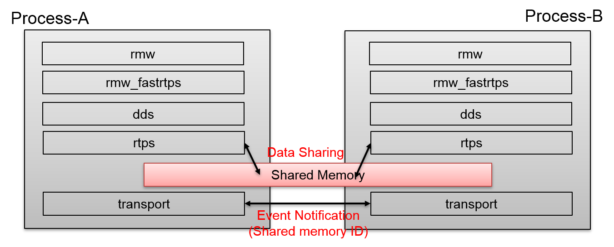
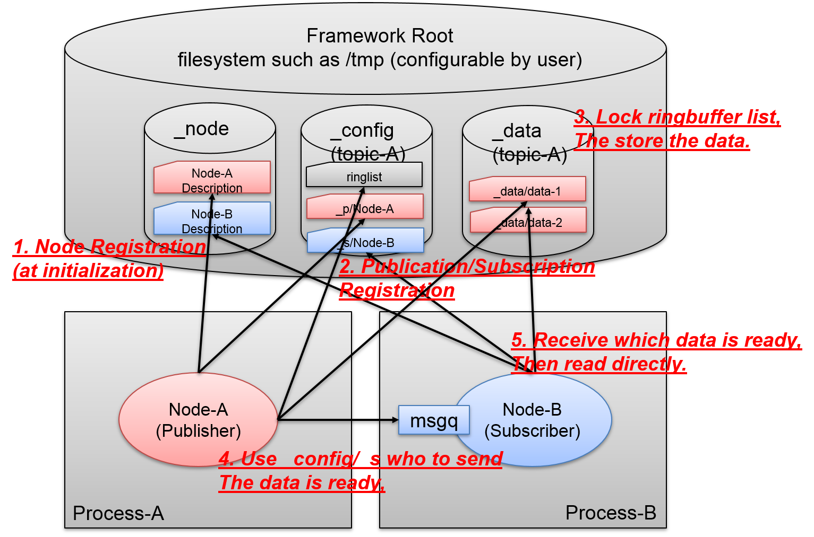
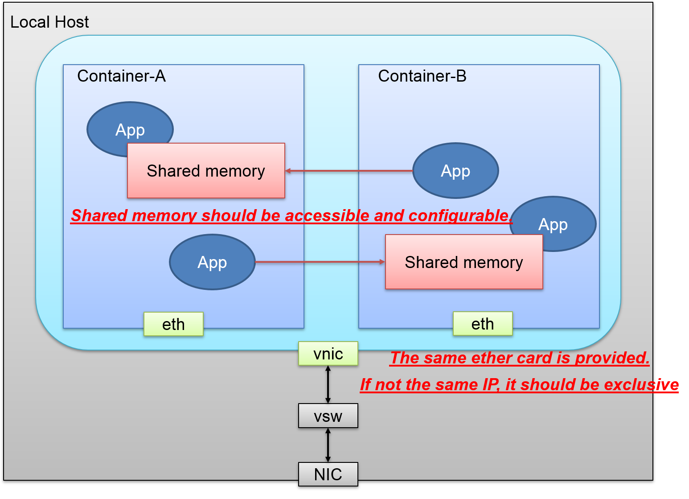

# RMW Data Sharing Framework

**the followings are Tomoya(Tomoya.Fujita@sony.com)'s consideraton, it will need the discussion on this to aim at the final goal and target with others and eProsima.**

## Conclusion

thinking about this new rmw data sharing message passing, we are doing **reinventing the wheel** here, that we Sony does not want to do. our final target is fastrtps with shared memory data sharing as for milestone#3, why do we have to consider the new rmw framework **including message passing** only for shared memory. off the top of my head, the following should be suitable for achieving the final target.

- Milestone#2 SHM data sharing only with fastrtps message framework. (NO new rmw implementation)
  taking advantage of fastrtps message passing, integrate data sharing via shared memroy w/o serialization/de-serialization. so that we do not care about discovery, message framework and so on. also this is better affinity because it is based on fastrtps.

- Milestone#3 fastrtps with data sharing.
  continue to milestone#2, consider about how to merge milestone#2 output into fastrtps. it should co-exist fastrtps and data sharing.

Question here is,

- what is the requirement and reason, we have to make the different framework aside from fastrtps? can we not use fastrtps message framework for shared memory?
- is there any intention from eProsima to do this? probably no...

## Requirement

- Multi-Operating System support (Linux, Mac and Windows)
- Only shared memory data sharing is in the focus on Milestone#2.
- Respectively optimization can be applied to specific platform. (most interest of Sony is Linux.)
- Aiming at **fastest (smallest latency and highest throughput)**. (instead of this, there is no sense for doing this.)
- Completely Zero-Copy for data sharing. (writer writes once, readers read directly from the shared memory)
- 1:N Publisher/Subscriber Architecture will be supported.
- No constraints for Class-1 ROS2 API's such as topic, parameter, service and actions so on.
- rmw loaned_message can be used on this as well. (thanks for Bosch.)
- Framework must be able to find who is participating, publishing or subscribing which topics exactly, this configuration information must be provided to rmw to support ROS2 frontend.

## Overview

## Data Sharing Framework

- File System Based
  - No Daemon is required, rely on kernel/system is more secured and avoid single point failure on application/daemon.
  - configuration data is in the storage.
  - hugetlb file system extension for the performance (described later)
  - default tmpfs/ramfs which is memory, and clean start via reboot
  - container sharable / configurable (easy to do this, just bind the filesystem to vm)

- Directory Structure
  "/" is used for namespace, it will be replace with "_". (making folder depends on namespace leads the depth of folder is unknown.)
  data and configuration information should be divided, so that we can mount hugetlbfs only on data folder to map the huge pages in the process space.

| Directory / File | Description |
| :--- | :--- |
| /SHM_ROOT | shared memory framework root folder, default tmpfs like /tmp, but user can specify the root directory via environment variable |
| /SHM_ROOT/_node | Node information folder, each node information files in this folder |
| /SHM_ROOT/_node/node-A | Node description file, file name is node name, includes GUID |
| /SHM_ROOT/_config | Topic configuration root directory |
| /SHM_ROOT/_config/topic-A | Topic-A Configuration directory |
| /SHM_ROOT/_config/topic-A/ringlist | Topic-A ring buffer control file |
| /SHM_ROOT/_config/topic-A/_p | Topic-A Configuration for publisher directory, node description file will be linked under here |
| /SHM_ROOT/_config/topic-A/_s | Topic-A Configuration for subscriber directory, node description file will be linked under here |
| /SHM_ROOT/_data | Topic data root directory, only user messages can be here |
| /SHM_ROOT/_data/topic-A/ | Topic-A data storage, data file corresponds to each message and file name is based on timestamp |

- boost::interprocess shared memory
  to support multi-operating system, this is already discussed before. there was nothing better to give it the abstraction than boost::interprocess.

- basic_managed_mapped_file
  used this to support shared memory with file system. each file corresponds to a message, so topic queue is 64, there will be 64 files in the same directory. file name should be based on timestamp so that we know when exactly the message is created. (also this could be useful for lifespan in feature extension later) files are controlled by ringbuffer file in configuration storage, accessing file message requires the lock the ring buffer file in the configuration storage. this is atomic access for any publisher in the same topic.

- File Locking Operations
  this is also supported via boost::interprocess.

- pagefault
  this is also supported and confirmed. since boost::interprocess segment is mapped into the physical memory, even if deallocate() that area, it will keep the page map so that pagefault does not occur. (memory retain can be supported via boost::interprocess.)

- huge TLB
  supporting large pages are key for big data size such as 2MB, 4MB and so on. this will reduce the pagefault at the 1st touch, and really can conserve the tte tlb entry slot as well so that tlb miss hit can be reduced as well.
  - boost::interprocess cannot support this flexibility as interface, so this has to be platform dependent optimization.
  - Linux Huge Page Interfaces
    https://www.kernel.org/doc/html/latest/admin-guide/mm/hugetlbpage.html
    Kernel Configuration (depends on the kernel)
    CONFIG_CGROUP_HUGETLB=y
    CONFIG_ARCH_WANT_GENERAL_HUGETLB=y
    CONFIG_HUGETLBFS=y
    CONFIG_HUGETLB_PAGE=y
    /proc/sys/vm/nr_hugepages
    /proc/sys/vm/hugetlb_shm_group

    hugetlbfs is used with sony framework, since this is filesystem based good affinity with inotify. if the system supports hugetlb as transparent, everything is taken care by system but i do not see most of the system cannot support transparent. (only enterprise servers.) and also we are not allowed to use hugetlb or not, it depends on the system kernel.

    i believe that using hugetlbfs than hugetlb mmap system call is better to have an abstraction for application. but hugetlbfs needs to be created before application starts.
    besides, boot::interprocess provides file-mapped shared memory as well, that means it ca take advantage of hugetlbfs if it creates file based on hugetlbfs.

    **to differentiate from other shared memory feature, this could be really performance advantage**

- Only writer has write permission, reader has read only permission.

- lifecycle of shared data.
  there would be some configuration,
  - discard at all. (best effort only)
    writer does not even care about readers, just keep using ring buffer. even if the data is NOT yet read by reader, writer does not care about that just keep updating data.
  - warning on discard.
    when write detected it is about to update the data in the buffer, and reader does not read the message. writer will notify user that discard is happened which topic and timestamp, message on reader might not be correct.
  - failure on discard.
    stop the process on writer if discarding happpens. publish() will be failed with error code.

- Data sharing within Containers.
  using docker container (more like runC runtime) is famous and most people use virtualization environment for robotics especially on development. even with container, data sharing should be able to be configure if data shared or not. (of course, containers should be in the same host system.)

## Event / Message Notification

- (writer sends event once when data is ready. (not deliverying event for each reader))
- boost::interprocess msgq
  each node will have own msgq corresponding to the node name, and this msgq name can be known from file system. writer needs to send the message for each receiver msgq.
- unnecessary event should be avoided. (everyone once receives event and filter is not efficient.)
- writer should be able to send the data/information what happened to multiple receiver at the same time. (just like multicast.)

### Consideration

- boost::interprocess msgq
  this is peer to peer(1:1) message framework, so cannot multicat the package to receivers. if 2 receivers on the same msgq, receivers gotta take round to get the message. (e.g, sender sends out 100 messages, receiver-A receives 50 messages and receiver-B does so.) but using boost::interprocess is good affinity with shared memory framework.

- [fsnotify](https://github.com/fsnotify/fsnotify)
  multi-platform filesystem notification event framework based on GO language. since this is GO language, we can compile the native code. but we should not rely on unknown framework like this. I am negative to count on this, just feeling.

- [fswatch](https://github.com/emcrisostomo/fswatch)
  cross-platform file system monitor, similar with fsnotify but c/cpp implementation so that we can refer the code.

- shared condition variable / semaphore
  this is also provided by boost::interprocess shared object, but using these stuff lead thread wait_lock, once it comes to the each topic event, there will be many thread needs to be created. besides cannot provide the data at the same time. using global shared object leads unnecessary events, so filtering on receiver is overhead as well.

- [Zero MQ](https://github.com/zeromq/libzmq)
  supports multi-platform(windows, Mac and Linux) cpp based Pub/Sub message passing including IPC, TCP and multicast. it looks perfect for the requirement, we can connect sockets N-to-N with patterns like fan-out, pub-sub, task distribution, and request-reply.
  but we are actually doing **reinventing the wheel** here, that we Sony does not want to do.
  because this is exactly about fastrtps message framework, except serilization, DDS, and RTPS protocol.

- What is feasible at the 1st step?
  - read files when if necessary, not efficient, cz every single time. msgq id should be node name as well, so just checking file name and cache data in memory.
  - or use hash file to indicate something is changed. then checking the files in the directory to compare the cached data in the memory.

- respectively adjustment should be done.

| Platform | Framework | Comment |
| :--- | :--- | :--- |
| Linux | inotify | Priority |
| Windows | ReadDirectoryChangesW | Nice to have |
| Mac | kqueue | Nice to have |

## Identification

the same exact GUID should be used for this shared memory framework, and it will be also stored in the filesystem. (looking at the filesystem, it should be able to see the whole configuration including identification) so that aiming at milestone#3, take advantage of this identification and tell who's who, where to publish/subscribe completely.

## User Interfaces

- Queue size of **each topic**
  user must be able to set the queue size for specific topic, and framework must guarantee this queue size. instead, failure on constructor with not possible to support specified queue size.

- Notification how much shared-memory will be consumed.
  user must be able to know the how much shared-memory is consuming on **each topic**, so that user can tune the queue size for each topics.

- QoS profiles for ROS2.

| QoS | Policy | Comment |
| :--- | :--- | :--- |
| History | Keep last | supported with Depth, actually this is queue size for ring buffer. |
| History | Keep all | Not supported |
| Depth | Queue size | supported, used this for ring buffer queue size for the topic, default 10 |
| Reliability | Best effort | supported(default) |
| Reliability | Reliable | Not supported |
| Durability | Transient local | Not supported |
| Durability | Volatile | supported(default) |
| Deadline | N.A | Not supported, but useful could be added later as extension |
| Lifespan | N.A | Not supported, but useful could be added later as extension |
| Liveliness | N.A | Not supported |

- root path on the filesystem.
  default /tmpfs or /tmp, but user can specify root path for this data sharing framework.
  all of the application should have the access permission to that root path.

# Out of Scope

the following could be dropped for milestone#2 target.

- Security ROS. (Encryption/Permission)
  Since this is actually relying on DDS Security, this can be out of scope with shared memory transport. (shared memory data sharing itself is NOT dds specification)
- Co-exist with fastrtps. (this is milestone#3 target)

# Appendix

- boost::interprocess shared object is emulated on un-supported platform such as windows or unix which does not support POSIX base shared memory. in that case, boost::interprocess emulate shared memory object using file based shared memory.

  **----- shared memory is emulated with mapped files created in a "boost_interprocess" folder created in a temporary files directory. In Windows platforms, if "Common AppData" key is present in the registry, "boost_interprocess" folder is created in that directory (in XP usually "C:\Documents and Settings\All Users\Application Data" and in Vista "C:\ProgramData"). For Windows platforms without that registry key and Unix systems, shared memory is created in the system temporary files directory ("/tmp" or similar). -----**
